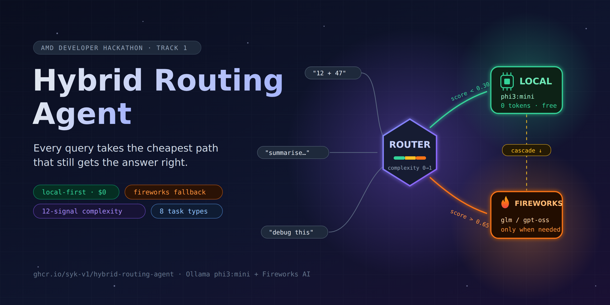

# hybrid-routing-agent



Routes each query to the cheapest model that can answer it correctly — local first, Fireworks AI as fallback. Built for the AMD Developer Hackathon (Track 1: General-Purpose AI Agent).

## How it works

Every query gets a complexity score (0–1) based on signals like query length, whether it involves code, math, multi-step reasoning, sentiment classification, entity extraction, or format-constrained summarisation. That score decides where it goes:

- **< 0.30** — local model only (phi3:mini via Ollama, costs nothing)
- **0.30–0.65** — try local first; if the model seems uncertain, escalate to remote
- **> 0.65** — straight to Fireworks AI

The local model runs for free and doesn't count toward the token score. Remote calls (via Fireworks AI) are only made when necessary, and are the only calls that count toward the competition's token-efficiency ranking.

## Competition submission (Docker)

The container contract: read tasks from `/input/tasks.json` (`[{"task_id", "prompt"}, ...]`), write `/output/results.json` (`[{"task_id", "answer"}, ...]`) before exiting, exit code 0 on success. `batch_runner.py` (run via `docker-entrypoint.sh`) implements this — it is the real competition entry point, not `main.py`.

The harness injects `FIREWORKS_API_KEY`, `FIREWORKS_BASE_URL`, and `ALLOWED_MODELS` at evaluation time — the image never bundles a `.env` or hardcodes a key/model ID. All Fireworks calls route through `FIREWORKS_BASE_URL`; `agent/config.py` picks a "fast" and "strong" model dynamically from `ALLOWED_MODELS` at runtime.

```bash
# build
docker build -t hybrid-routing-agent .

# run locally against a sample input (already in the {task_id, prompt} shape)
mkdir -p /tmp/hra/input /tmp/hra/output
cp eval/sample_input/tasks.json /tmp/hra/input/tasks.json
docker run --rm \
  -e FIREWORKS_API_KEY=... \
  -e FIREWORKS_BASE_URL=https://api.fireworks.ai/inference/v1 \
  -e ALLOWED_MODELS="accounts/fireworks/models/<fast-id>,accounts/fireworks/models/<strong-id>" \
  -v /tmp/hra/input:/input:ro \
  -v /tmp/hra/output:/output \
  hybrid-routing-agent
cat /tmp/hra/output/results.json

# push
docker tag hybrid-routing-agent ghcr.io/<org>/hybrid-routing-agent:latest
docker push ghcr.io/<org>/hybrid-routing-agent:latest
```

### CI

`.github/workflows/docker-build.yml` builds the image, checks it against the 10GB size cap, and smoke-tests it against `eval/sample_input/tasks.json` on every push (using a dummy Fireworks key, so only the local-inference path and the JSON contract are actually exercised). Trigger it manually with the `push` input set to publish the image to `ghcr.io/<this-repo>` after a green run.

## Results

12/12 accuracy on the sample task suite with **0 remote tokens** used — phi3:mini handles everything in the test set on its own.

## Local dev setup

```bash
git clone https://github.com/syk-v1/hybrid-routing-agent
cd hybrid-routing-agent
pip install -r requirements.txt
cp .env.example .env   # add your FIREWORKS_API_KEY
ollama pull phi3:mini
ollama serve
```

## Usage

```bash
# run a single query (manual dev tool, not the competition entry point)
python main.py "What is the capital of France?"

# evaluate accuracy and token spend across the test suite
python eval/eval.py --verbose

# try it without Ollama or an API key
python dryrun_test.py
```

## Configuration

Set these in `.env` for local dev. `FIREWORKS_API_KEY`, `FIREWORKS_BASE_URL`, and `ALLOWED_MODELS` are harness-injected at evaluation time in the submitted image — never hardcode or bundle them.

| Variable | Default | What it does |
|---|---|---|
| `FIREWORKS_API_KEY` | — | Harness-injected at eval time; your own key for local dev |
| `FIREWORKS_BASE_URL` | `https://api.fireworks.ai/inference/v1` | Harness-injected at eval time — all Fireworks calls must route through this |
| `ALLOWED_MODELS` | — | Harness-injected, comma-separated model IDs; picks fast/strong dynamically. Unset locally falls back to `REMOTE_MODEL_FAST`/`REMOTE_MODEL_STRONG` |
| `LOCAL_MODEL` | `phi3:mini` | Local model name in Ollama |
| `REMOTE_MODEL_FAST` | `glm-5p1` | Local dev fallback only — ignored whenever `ALLOWED_MODELS` is set |
| `REMOTE_MODEL_STRONG` | `gpt-oss-120b` | Local dev fallback only — ignored whenever `ALLOWED_MODELS` is set |
| `REMOTE_TIMEOUT` | `45` | Per-call timeout (seconds) for Fireworks requests |
| `COMPLEXITY_LOW` | `0.30` | Below this → always local |
| `COMPLEXITY_HIGH` | `0.65` | Above this → always remote |
| `CONFIDENCE_THRESHOLD` | `0.60` | Cascade: escalate if local confidence is below this |

## Project structure

```
agent/
  config.py       environment + thresholds + dynamic model selection
  router.py       complexity scorer (12 signals)
  local_model.py  Ollama wrapper + confidence heuristic
  remote_model.py Fireworks AI client + token counter
  agent.py        orchestrates routing and fallback
eval/
  eval.py         accuracy + token cost reporting
  sample_tasks.json
batch_runner.py    competition entry point — /input/tasks.json -> /output/results.json
docker-entrypoint.sh   starts Ollama, waits for readiness, runs batch_runner.py
Dockerfile         bundles Ollama + phi3:mini + app code
main.py            manual single-query dev tool (not the competition entry point)
```

## Stack

- Local inference: [Ollama](https://ollama.com) + phi3:mini
- Remote inference: [Fireworks AI](https://fireworks.ai)
- Python 3.9+, no frameworks
